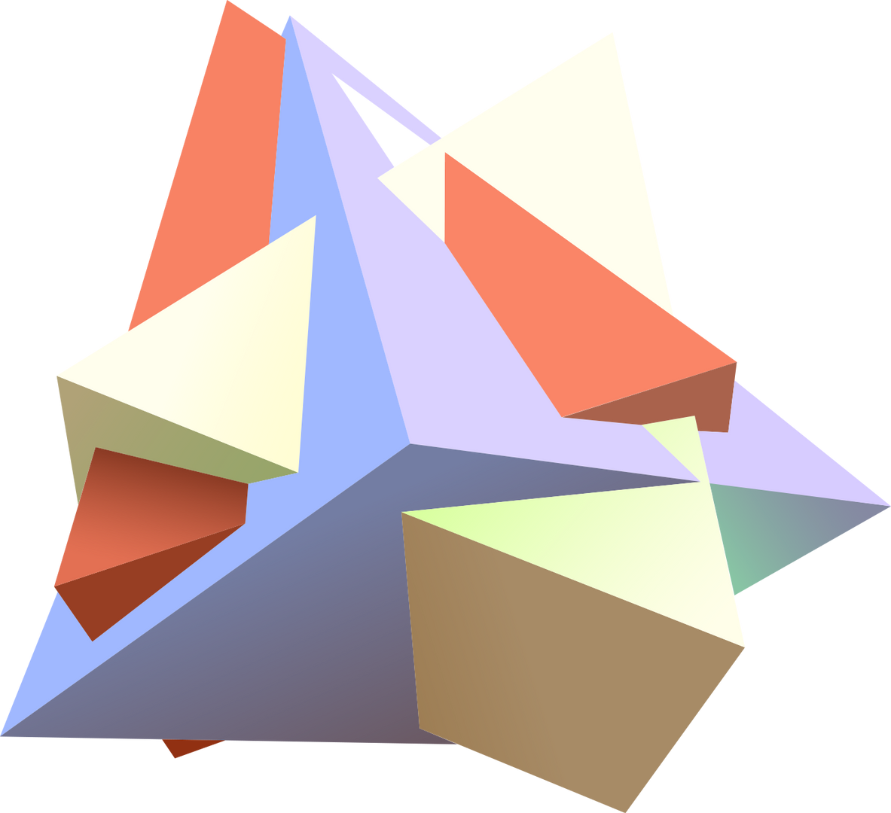

<!DOCTYPE html>
<html style="font-size: 16px;">
  <head>
    <meta name="viewport" content="width=device-width, initial-scale=1.0">
    <meta charset="utf-8">
    <meta name="keywords" content="​How it works, INTUITIVE">
    <meta name="description" content="">
    <title>Главная</title>
    <link rel="stylesheet" href="nicepage.css" media="screen">
<link rel="stylesheet" href="Главная.css" media="screen">
    
    
    <meta name="generator" content="Nicepage 4.11.3, nicepage.com">
    <link id="u-theme-google-font" rel="stylesheet" href="https://fonts.googleapis.com/css?family=Roboto:100,100i,300,300i,400,400i,500,500i,700,700i,900,900i|Open+Sans:300,300i,400,400i,500,500i,600,600i,700,700i,800,800i">
    <link id="u-page-google-font" rel="stylesheet" href="https://fonts.googleapis.com/css?family=Rubik:300,300i,400,400i,500,500i,600,600i,700,700i,800,800i,900,900i">
    
    
    
    
    <meta name="theme-color" content="#478ac9">
    <meta property="og:title" content="Главная">
    <meta property="og:type" content="website">
  </head>
  <body class="u-body u-xl-mode"><header class="u-clearfix u-header u-header" id="sec-6ef5">

        
        <nav class="u-menu u-menu-dropdown u-offcanvas u-menu-1">
          

            <a class="u-button-style u-custom-left-right-menu-spacing u-custom-padding-bottom u-custom-top-bottom-menu-spacing u-nav-link u-text-active-palette-1-base u-text-hover-palette-2-base" href="#">
              <svg class="u-svg-link" viewBox="0 0 24 24"><use xmlns:xlink="http://www.w3.org/1999/xlink" xlink:href="#menu-hamburger"></use></svg>
              <svg class="u-svg-content" version="1.1" id="menu-hamburger" viewBox="0 0 16 16" x="0px" y="0px" xmlns:xlink="http://www.w3.org/1999/xlink" xmlns="http://www.w3.org/2000/svg"><g><rect y="1" width="16" height="2"></rect><rect y="7" width="16" height="2"></rect><rect y="13" width="16" height="2"></rect>
</g></svg>
            </a>
          

          

            <ul class="u-nav u-unstyled u-nav-1"><li class="u-nav-item"><a class="u-button-style u-nav-link u-text-active-palette-1-base u-text-hover-palette-2-base" href="Главная.html" style="padding: 10px 20px;">Главная</a>
</li><li class="u-nav-item"><a class="u-button-style u-nav-link u-text-active-palette-1-base u-text-hover-palette-2-base" href="О-нас.html" style="padding: 10px 20px;">О нас</a>
</li><li class="u-nav-item"><a class="u-button-style u-nav-link u-text-active-palette-1-base u-text-hover-palette-2-base" href="Контакты.html" style="padding: 10px 20px;">Контакты</a>
</li></ul>
          

          

            

              

                

                <ul class="u-align-center u-nav u-popupmenu-items u-unstyled u-nav-2"><li class="u-nav-item"><a class="u-button-style u-nav-link" href="Главная.html">Главная</a>
</li><li class="u-nav-item"><a class="u-button-style u-nav-link" href="О-нас.html">О нас</a>
</li><li class="u-nav-item"><a class="u-button-style u-nav-link" href="Контакты.html">Контакты</a>
</li></ul>
              

            

            

          

        </nav>
      
</header>
    <section class="u-align-center u-clearfix u-image u-section-1" id="carousel_0960" data-image-width="2000" data-image-height="1353">
      

        

          

            

              

                

                  

                  
                

              

              

                

                  <h2 class="u-custom-font u-text u-text-body-alt-color u-text-1"> How it works</h2>
                  
 Duis aute irure dolor in reprehenderit in voluptate velit esse cillum dolore eu fugiat nulla pariatur. Excepteur sint occaecat cupidatat non proident, sunt in culpa qui officia deserunt mollit anim id est laborum.

                  
Image from <a href="https://www.freepik.com/vectors/business-pattern" class="u-border-1 u-border-active-palette-3-light-2 u-border-hover-palette-3-light-2 u-border-white u-btn u-button-style u-none u-text-active-palette-3-light-2 u-text-body-alt-color u-text-hover-palette-3-light-2 u-btn-1">Freepik</a>
                  

                  <a href="https://nicepage.com/one-page-template" class="u-active-palette-1-light-2 u-border-none u-btn u-btn-round u-button-style u-hover-palette-1-light-2 u-radius-50 u-text-active-white u-text-hover-white u-text-palette-3-base u-white u-btn-2">read more</a>
                

              

            

          

        

      

    </section>
    <section class="u-align-center u-clearfix u-image u-shading u-section-2" src="" data-image-width="256" data-image-height="256" id="sec-3e06">
      

        <h1 class="u-text u-text-default u-title u-text-1">INTUITIVE</h1>
        
Sample text. Lorem ipsum dolor sit amet, consectetur adipiscing elit nullam nunc justo sagittis suscipit ultrices.

        <a href="#" class="u-btn u-button-style u-palette-2-base u-btn-1">Read More</a>
      

    </section>
    
    
    <footer class="u-align-center u-clearfix u-footer u-grey-80 u-footer" id="sec-b457">

        
Пример текста. Кликните, чтобы выбрать элемент "Текст".

      
</footer>
    <section class="u-backlink u-clearfix u-grey-80">
      <a class="u-link" href="https://nicepage.com/website-templates" target="_blank">
        Website Templates
      </a>
      

        created with
      

      <a class="u-link" href="" target="_blank">
        Website Builder Software
      </a>. 
    </section>
  </body>
</html>
